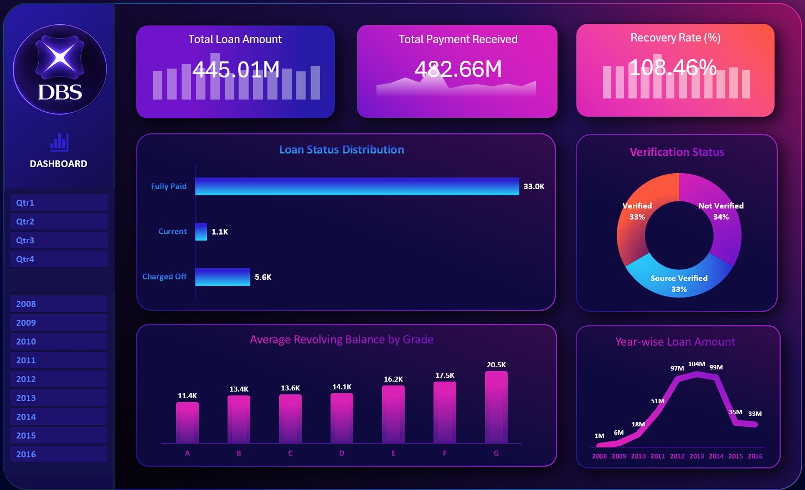
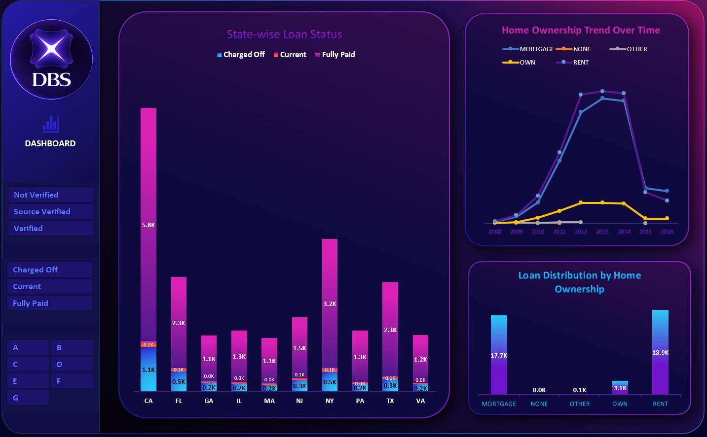

# Bank Loan Customer Analytics

## Project Overview
This project analyzes bank loan data to understand customer behavior, loan performance, and financial trends.

## Tools Used
- Excel
- SQL
- Power BI
- Tableau

## Key Insights
- Loan status distribution (Fully Paid, Current, Charged Off)
- Year-wise loan trends
- Customer home ownership analysis
- State-wise loan distribution
- Verification status impact

## Dashboard Preview

### Power BI Dashboard

### Excel Dashboard

### Tableau Dashboard

### SQL Analysis

## Author
Harsha Vardhan Raju Karapa  
Aspiring Data Analyst
